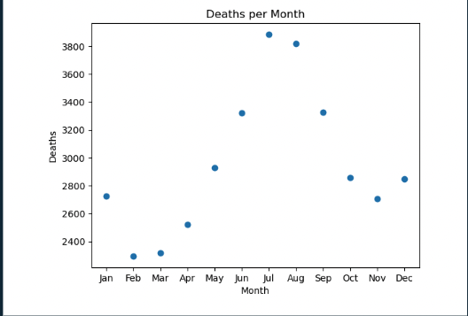
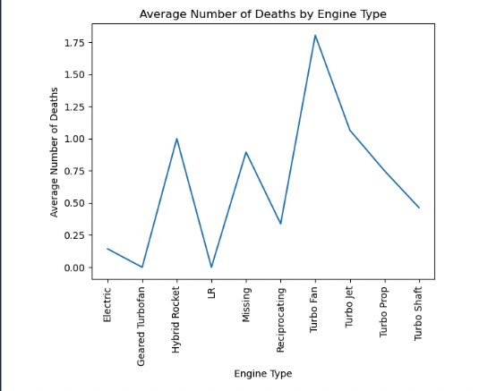
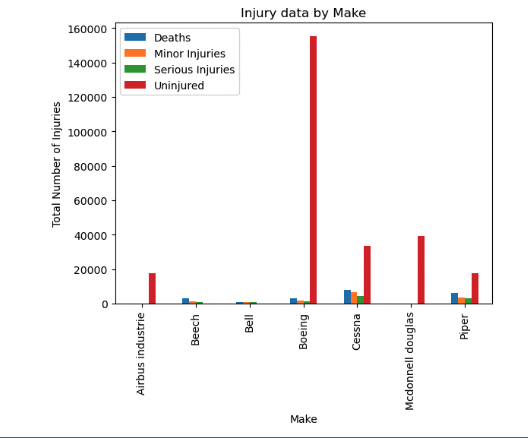

# Aviation Analysis

Author: Aashish Gatamaneni

## Business Problem
This project takes a look at the Aviation Accident Dataset which contains data about civil aviation accidents and incidents in the United States and its territories, and international waters. Using this dataset, I identify patterns in accidents that result in the most damage to the aircraft and its passengers to help the Aviation company determine aircrafts that present lower risks for the company.

## Data Understanding
The Aviation Accident Database contains aviation accident data from 1962-2023 with each accident is given a unique ID that displays all the accident and aircraft data associated with that unique ID (e.g. weather, aircraft model, etc.). This project uses descriptive analysis to help discover patterns and trends over time

## Results


As expected, the number of deaths peak in the summer months. However, the gradual increase shows that temperature is major factor along with it being travel season.



The General Turbofan, LR engines, and Reciprocating are relatively safer when compared to the Turbo Fan engine which has the highest number of average deaths.



When taking a look at all the injury severity data for each aircraft, Boeing has the highest ratio of uninjured to injured.

## Conclusions

After extensive analysis of the data, the analyis led to three recommendations for the aviation division:
- **Fly in the colder months of the year. We can see that a majority of aviation accidents happen in the summer.** Gradually starts to rise in April and peaks in July and August. Although some of this could be attributed to more people travelling in the summer, it's could be correlated with the temperature increase causing more changes in air density, engine failures, etc., we can concluded this based of the gradual rise of the accidents as the temperature was increasing rather than a sharp peak in June, July, August.

- **Invest in aircrafts with the Reciprocating engine.** The Reciprocating engine has one of the lowest average number of deaths per accident and is the most common engine type. Avoid the aircrafts with Turbo Fan and Hybrid Rocket engines which each average more than 1 death per accident much higher than the other engines, while also not having much data to back it.

- **We recommend purchasing a Boeing aircraft IF cost is not an issue.** A Boeing aircraft is always equipped with the safest engine types and has the most extensive data regarding its accidents. In this aviation accident dataset, the Boeing aircraft boasts the most uninjured per flight time and time again. If safety is the primary goal, you can't go wrong with the Boeing aircraft.

## Next Steps
Two areas to look at:
- **Purpose of Flight**
    - We could take a look to see if the purpose of flight has an effect on any of our main measures.
- **Event Date**
    - We already saw how the month affects the total amount of death. We could also look how many deaths/injuries were caused each year.

## Limitations
- When looking at the descriptive statistics, two of the columns we used as measures, total_fatal_inuries and total_uninjured, had very high standard deviations meaning the data was very spread out. Something to consider when interpreting the data.
- Some aircrafts had very minimal data to work with causing some data visualizations to be taken without proper context.

## Take a Deeper Look


## Repository Structure

```
├── data
├── images
├── .gitignore
├── Aviation Data Analysis.pdf
├── README.md
└── aviation_data_analysis.ipynb
```
